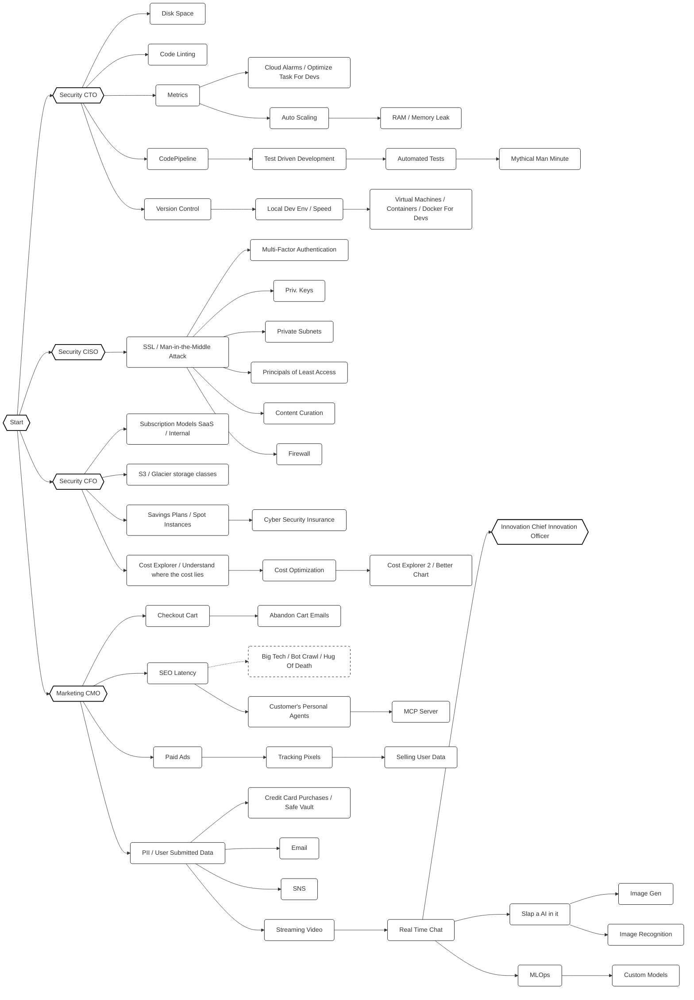

# Project Plan - Reusable Map Component & Meta Progression

## Current Objective
Refactor `UITechTreePanel.cs` into a reusable `UIMapPanel` component and implement the `iMapNode` interface to support Tech Tree, Org Chart, Meta Unlock Map, and Product Road Map. Integrate `PrestigePoints` meta-currency for the Meta Unlock Map.

## Phase 1: Research & Assumptions
- **Key Files & Systems:** `UITechTreePanel.cs`, `Technology.cs`, `MetaGameManager.cs`, `UIPanel.cs`, `UIPanelLine.cs`.
- **PrestigePoints:** Need to ensure `PrestigePoints` is added to `MetaProgressData.cs` and handled in `MetaGameManager`.
- **Validation:** 
  - `iMapNode` must support: `Id`, `DisplayName`, `Description`, `Icon`, `Direction`, `DependencyIds`, `CurrentState` (mapped from specific systems), and `OnSelected(UIMapPanel panel)`.
  - `UIMapPanel` must be abstract with a `PopulateNodes()` method.

## Phase 2: Strategy
- **Approach:** 
  - **Interface:** Define `iMapNode` and generic enums for `MapNodeState` and `MapNodeDirection`.
  - **Meta Currency:** Add `PrestigePoints` to `MetaProgressData` and implement spending logic in `MetaGameManager`.
  - **Refactoring:** 
    - Create `UIMapPanel` (Abstract) inheriting from `UIPanel`. Move tilemap, panning, zooming, and procedural layout logic here.
    - `UIMapPanel` will work with a list of `iMapNode`.
    - `Technology` will implement `iMapNode`.
    - Create `UIMetaUnlockPanel` inheriting from `UIMapPanel` using `PrestigePoints`.
- **Architectural Alignment:** 
  - Use `UIPanelLine` system for the side detail pane.
  - No `var`, no Coroutines.
  - Tilemap Z-as-Y sorting.

## Phase 3: Execution Steps (Plan -> Act -> Validate)
- [ ] **Step 1:** Define `iMapNode`, `MapNodeState`, and `MapNodeDirection` in `interfaces.cs`.
- [ ] **Step 2:** Update `MetaProgressData.cs` to include `PrestigePoints`.
- [ ] **Step 3:** Update `Technology.cs` to implement `iMapNode`.
- [ ] **Step 4:** Create `UIMapPanel.cs` by refactoring `UITechTreePanel.cs`. Abstract the layout and node rendering.
- [ ] **Step 5:** Re-implement `UITechTreePanel.cs` as a concrete subclass of `UIMapPanel`.
- [ ] **Step 6:** Create `UIMetaUnlockPanel.cs` as a concrete subclass of `UIMapPanel`.
- [ ] **Step 7:** Implement `PrestigePoints` allocation logic in `MetaGameManager` and `iMapNode` implementations for meta unlocks.

## Phase 4: Validation & Testing
- **Test Strategy:** 
  - Verify Tech Tree still works exactly as before.
  - Verify Meta Unlock Map renders nodes correctly.
  - Verify `OnSelected` updates the detail pane using `UIPanelLine` system.
## Product Road Map Visual

